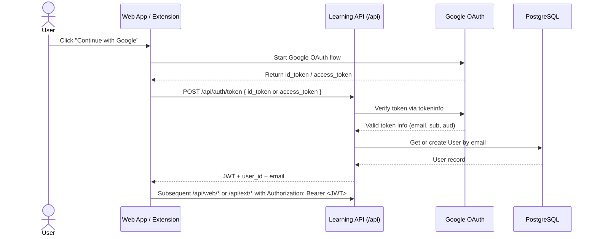
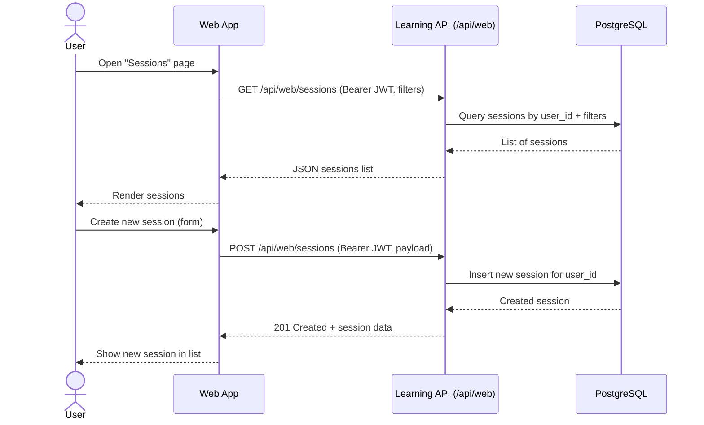
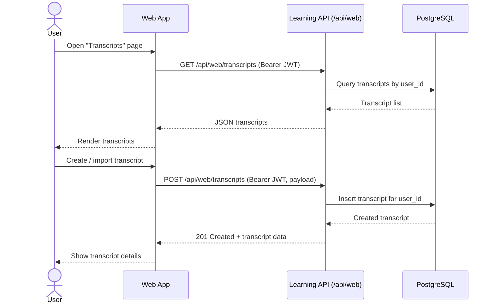
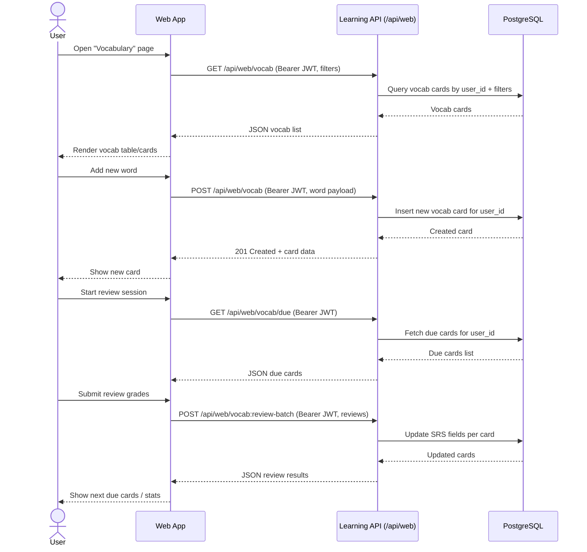
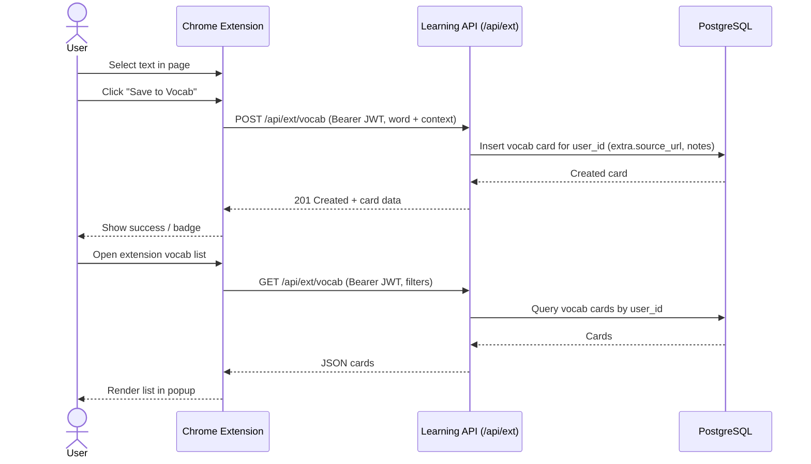
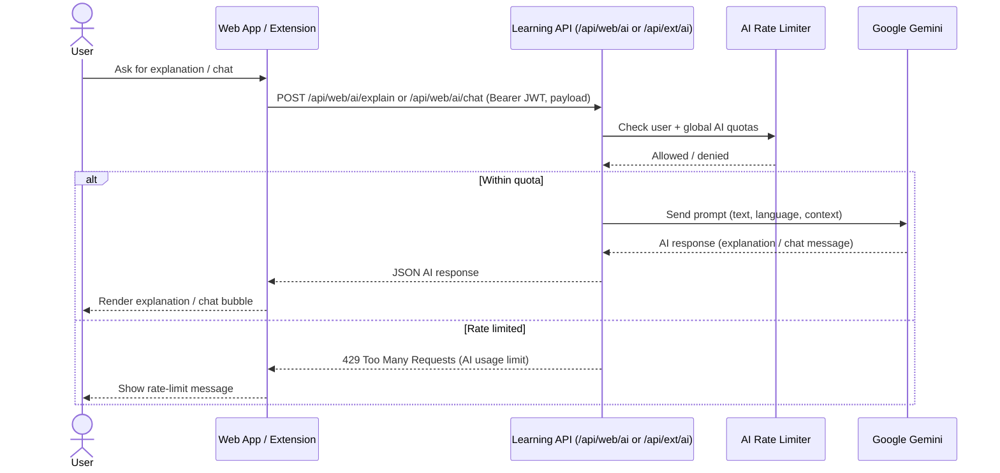
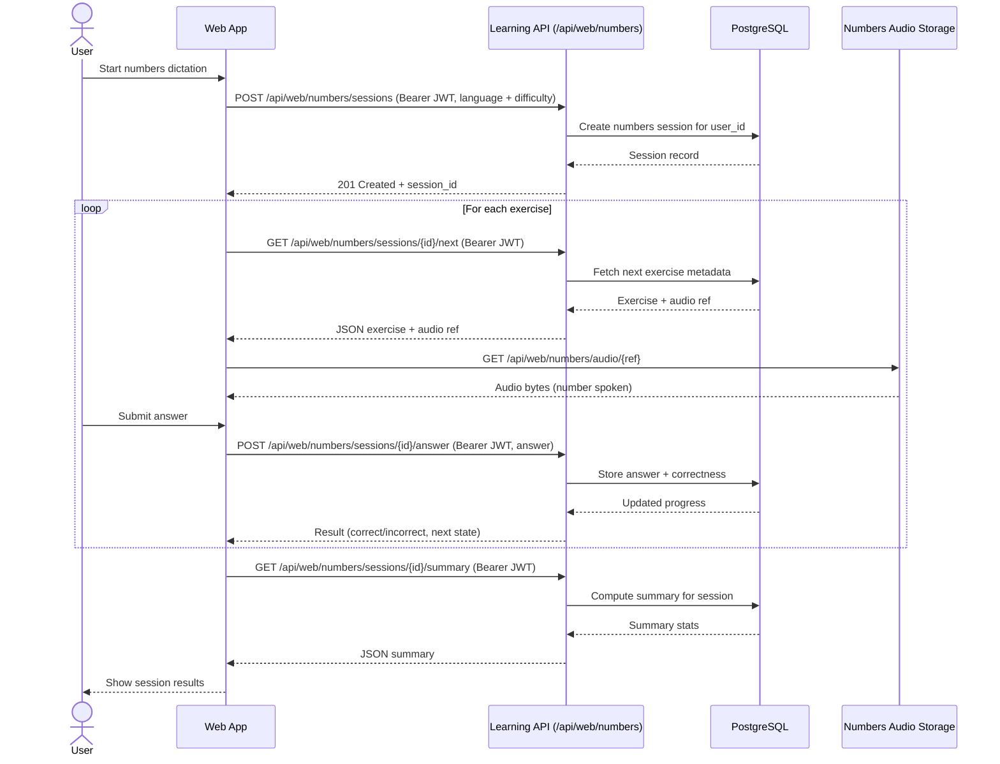
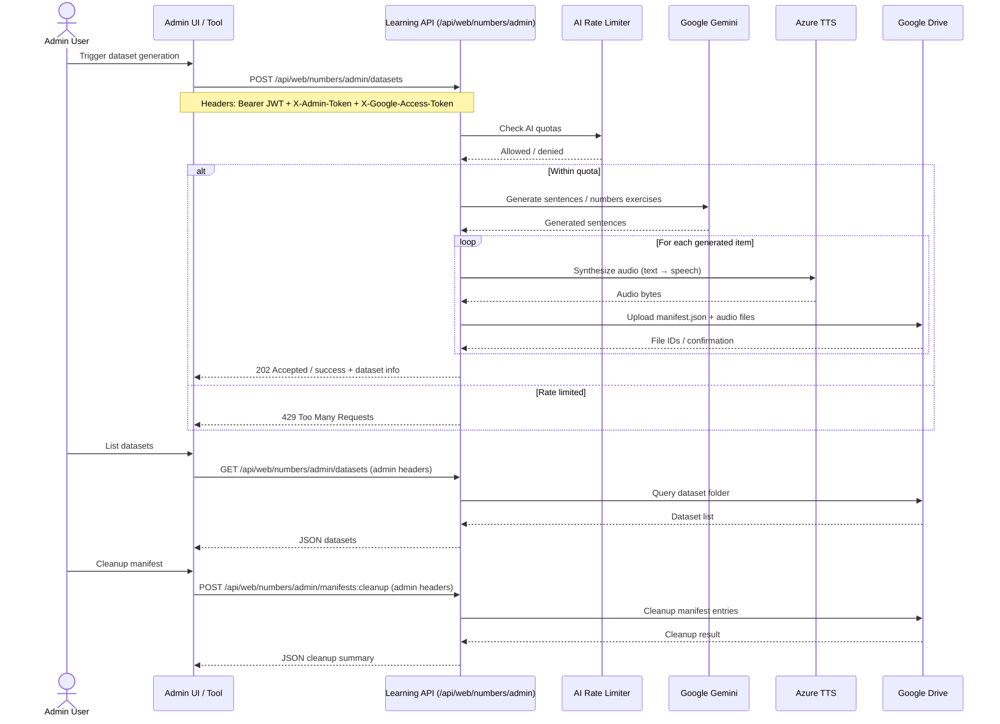
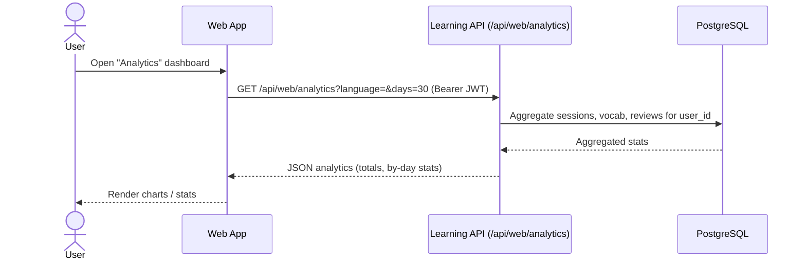

# System Flows (Mermaid Diagrams)

This document shows high-level request flows between clients and the Learning API using Mermaid diagrams.

Each diagram focuses on a specific feature area and follows the path:
**Client → Learning API → External Services (Google, Gemini, Azure, Drive, DB)**.

> Note: All application endpoints (except health check) require a valid JWT from the **Login / Auth** flow.

---

## 1. Login / Auth Flow

---

## 2. Sessions Flow (Create & List)

---

## 3. Transcripts Flow

---

## 4. Vocabulary Flow (Web)

---

## 5. Vocabulary Flow (Chrome Extension)

---

## 6. AI Flow (Explain & Chat)

---

## 7. Numbers Dictation Flow (User)

---

## 8. Numbers Dictation Admin Flow

---

## 9. Analytics Flow

