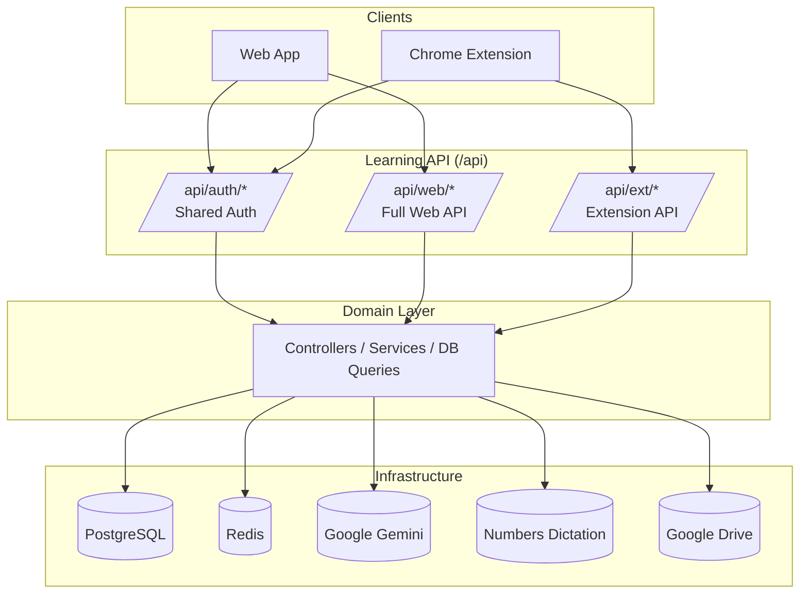
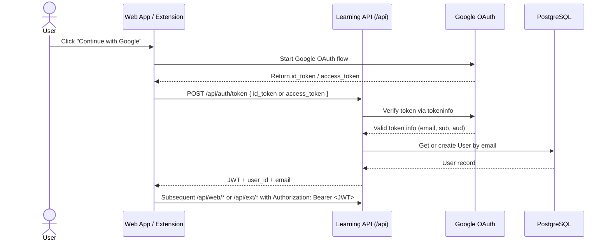
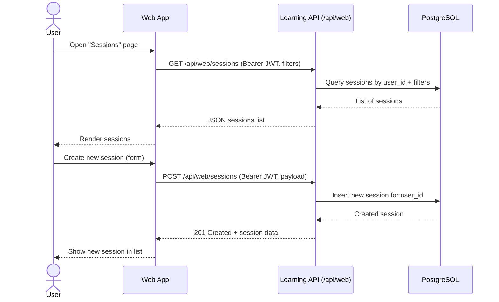
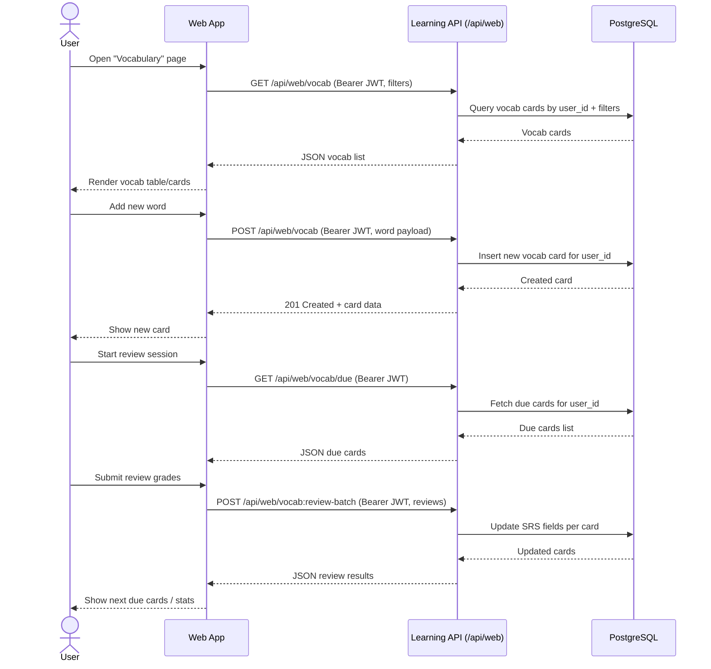
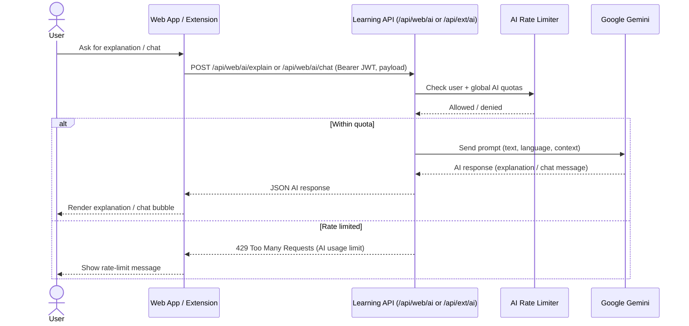
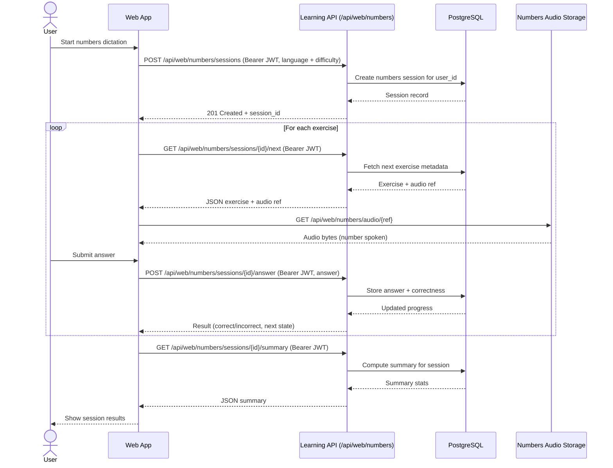

# MemoMap Learning Backend

Unified documentation for the MemoMap Learning backend:
- High‑level overview & setup
- Authentication and login flow
- Main API surface (web + extension)
- End‑to‑end flows as Mermaid diagrams

---

## 1. Overview

The Learning API serves both the **Web Application** and the **Chrome Extension** through a single backend.

- 📚 Vocabulary flashcards with SRS (Spaced Repetition System)  
- ⏱️ Learning sessions tracking  
- 📝 Transcripts and notes  
- 🔢 Numbers dictation exercises  
- 🤖 AI‑powered explanations and chat  

Tech stack:
- Python + Flask
- PostgreSQL (data), Redis (cache / rate limiting)
- JWT for authentication
- Google Gemini for AI features

**Base URL:** `/api`

Project structure (high level):

```text
src/
├── api/              # HTTP Layer (views, auth)
├── domain/           # Business Logic (controllers, services)
├── infra/            # Infrastructure (DB, Redis, AI, JWT)
├── shared/           # Shared Features (AI, Numbers)
└── utils/            # Utilities
```

See `STRUCTURE.md` for a deeper breakdown of modules and packages.

---

## 2. Getting Started

Backend root: this directory.

### 2.1. Environment

Required environment variables (non‑exhaustive):

| Variable         | Description      |
|------------------|------------------|
| `SECRET_KEY`     | Flask secret     |
| `POSTGRES_DSN`   | PostgreSQL DSN   |
| `REDIS_URL`      | Redis URL        |
| `GEMINI_API_KEY` | Gemini API key   |

See `src/config.py` and `.env.example` (if present) for the full list.

### 2.2. Install & Run (uv)

Using `uv` (recommended):

```bash
# Install dependencies
uv sync

# Run the app
uv run python run.py
```

Or with plain `pip`:

```bash
pip install -r requirements.txt
alembic upgrade head
python run.py
```

---

## 3. Architecture (High Level)



---

## 4. Authentication & Login

All non‑health endpoints require a **JWT Bearer Token**:

```http
Authorization: Bearer <jwt>
```

### 4.1. Login Flow (Web + Extension)



### 4.2. Auth Endpoints

All under `/api/auth/*`:

| Method | Endpoint       | Auth | Description                                   |
|--------|----------------|------|-----------------------------------------------|
| POST   | `/auth/token`  | ❌   | Exchange Google token for app JWT            |
| GET    | `/auth/verify` | ✅   | Verify JWT token validity                    |
| GET    | `/auth/me`     | ✅   | Get current authenticated user info          |
| POST   | `/auth/init`   | ✅   | No‑op init; kept for extension compatibility |

**`POST /api/auth/token` (summary)**  
Request body:

```json
{
  "id_token": "google_id_token",
  "access_token": "google_access_token" // optional alternative
}
```

On success, returns:

```json
{
  "status": "success",
  "data": {
    "token": "<jwt>",
    "user_id": "uuid-string",
    "email": "user@example.com"
  }
}
```

Use the `token` value as the Bearer token in all subsequent calls.

---

## 5. Web API Surface (`/api/web/*`)

### 5.1. Sessions

| Method | Endpoint             | Description              |
|--------|----------------------|--------------------------|
| GET    | `/web/sessions`      | List learning sessions   |
| POST   | `/web/sessions`      | Create new session       |
| GET    | `/web/sessions/{id}` | Get session by ID        |

**`GET /api/web/sessions` – Example**

- Headers:
  - `Authorization: Bearer <jwt>`
- Response:

```json
{
  "status": "success",
  "data": {
    "items": [
      {
        "id": "uuid",
        "language": "fr",
        "name": "French Practice",
        "duration_seconds": 1800,
        "tags": ["grammar"],
        "created_at": "2024-01-15T10:30:00Z"
      }
    ],
    "total": 42,
    "limit": 20,
    "offset": 0
  }
}
```

**`POST /api/web/sessions` – Example**

- Headers:
  - `Authorization: Bearer <jwt>`
- Request:

```json
{
  "language": "fr",
  "name": "French Practice",
  "duration_seconds": 1800,
  "tags": ["grammar", "podcast"],
  "extra": {}
}
```

- Response (`201 Created`):

```json
{
  "status": "success",
  "data": {
    "id": "uuid",
    "language": "fr",
    "name": "French Practice",
    "duration_seconds": 1800,
    "tags": ["grammar", "podcast"],
    "created_at": "2024-01-15T10:30:00Z"
  }
}
```

### 5.2. Transcripts

| Method | Endpoint                 | Description               |
|--------|--------------------------|---------------------------|
| GET    | `/web/transcripts`       | List transcripts          |
| POST   | `/web/transcripts`       | Create transcript         |
| GET    | `/web/transcripts/{id}`  | Get transcript            |
| PUT    | `/web/transcripts/{id}`  | Update transcript         |
| DELETE | `/web/transcripts/{id}`  | Delete transcript         |

**`POST /api/web/transcripts` – Example**

- Headers:
  - `Authorization: Bearer <jwt>`
- Request:

```json
{
  "language": "fr",
  "source_url": "https://youtube.com/watch?v=...",
  "transcript": "Full transcript text...",
  "notes": ["Key point 1", "Key point 2"],
  "tags": ["podcast", "news"],
  "lesson_audio_folder_id": "drive_folder_id",
  "extra": {}
}
```

- Response (`201 Created`):

```json
{
  "status": "success",
  "data": {
    "id": "uuid",
    "language": "fr",
    "source_url": "https://youtube.com/watch?v=...",
    "transcript": "Full transcript text...",
    "notes": ["Key point 1", "Key point 2"],
    "tags": ["podcast", "news"],
    "lesson_audio_folder_id": "drive_folder_id",
    "created_at": "2024-01-15T10:30:00Z"
  }
}
```

### 5.3. Vocabulary (with SRS)

| Method | Endpoint                    | Description                     |
|--------|-----------------------------|---------------------------------|
| GET    | `/web/vocab`                | List vocabulary cards           |
| POST   | `/web/vocab`                | Create vocabulary card          |
| GET    | `/web/vocab/{id}`           | Get vocabulary card             |
| PATCH  | `/web/vocab/{id}`           | Update vocabulary card          |
| DELETE | `/web/vocab/{id}`           | Soft delete (suspend) card      |
| DELETE | `/web/vocab/{id}/hard`      | Permanently delete card         |
| GET    | `/web/vocab/due`            | Get due cards for review        |
| POST   | `/web/vocab:review-batch`   | Submit batch review results     |
| GET    | `/web/vocab/stats`          | Get vocabulary statistics       |

**`GET /api/web/vocab` – Example**

- Headers:
  - `Authorization: Bearer <jwt>`
- Query params (optional):
  - `language`, `limit`, `offset`, `q`
- Response:

```json
{
  "status": "success",
  "data": {
    "items": [
      {
        "id": "uuid",
        "language": "fr",
        "word": "bonjour",
        "translation": "hello",
        "notes": ["Used in formal settings"],
        "tags": ["greetings"],
        "srs_level": 3,
        "ease_factor": 2.5,
        "next_review": "2024-01-20T10:00:00Z",
        "created_at": "2024-01-15T10:30:00Z"
      }
    ],
    "total": 150,
    "limit": 50,
    "offset": 0
  }
}
```

**`POST /api/web/vocab` – Example**

```json
{
  "language": "fr",
  "word": "bonjour",
  "translation": "hello",
  "notes": ["Used in formal settings"],
  "tags": ["greetings"],
  "extra": {}
}
```

**`GET /api/web/vocab/due` – Example**

```json
{
  "status": "success",
  "data": {
    "cards": [
      {
        "id": "uuid",
        "word": "bonjour",
        "translation": "hello",
        "srs_level": 3,
        "last_reviewed": "2024-01-15T10:00:00Z"
      }
    ],
    "count": 15
  }
}
```

**`POST /api/web/vocab:review-batch` – Example**

```json
{
  "reviews": [
    { "card_id": "uuid-1", "grade": "good" },
    { "card_id": "uuid-2", "grade": "again" },
    { "card_id": "uuid-3", "grade": "easy" }
  ]
}
```

**`GET /api/web/vocab/stats` – Example**

```json
{
  "status": "success",
  "data": {
    "total_cards": 150,
    "cards_by_level": {
      "0": 10,
      "1": 25,
      "2": 40,
      "3": 35,
      "4": 25,
      "5": 15
    },
    "due_today": 12,
    "reviewed_today": 8
  }
}
```

### 5.4. AI (Web)

| Method | Endpoint           | Description              |
|--------|--------------------|--------------------------|
| POST   | `/web/ai/explain`  | Explain text with AI     |
| POST   | `/web/ai/chat`     | Chat with AI tutor       |

**`POST /api/web/ai/explain` – Example**

```json
{
  "text": "Je voudrais un café, s'il vous plaît",
  "language": "fr",
  "context": "At a restaurant"
}
```

Response:

```json
{
  "status": "success",
  "data": {
    "explanation": "This phrase means 'I would like a coffee, please'...",
    "breakdown": [
      { "word": "voudrais", "meaning": "would like", "grammar": "conditional" }
    ]
  }
}
```

**`POST /api/web/ai/chat` – Example**

```json
{
  "message": "How do I use the subjunctive in French?",
  "language": "fr",
  "conversation_id": "conv-uuid"
}
```

Response:

```json
{
  "status": "success",
  "data": {
    "response": "The subjunctive mood in French is used to express...",
    "conversation_id": "conv-uuid"
  }
}
```

### 5.5. Numbers Dictation (User)

| Method | Endpoint                             | Description                    |
|--------|--------------------------------------|--------------------------------|
| POST   | `/web/numbers/sessions`             | Create dictation session       |
| GET    | `/web/numbers/sessions/{id}/next`   | Get next exercise              |
| POST   | `/web/numbers/sessions/{id}/answer` | Submit answer                  |
| GET    | `/web/numbers/sessions/{id}/summary`| Get session summary            |
| GET    | `/web/numbers/audio/{ref}`          | Stream audio file              |

**`POST /api/web/numbers/sessions` – Example**

```json
{
  "language": "fr",
  "difficulty": "medium",
  "count": 10
}
```

Response:

```json
{
  "status": "success",
  "data": {
    "session_id": "uuid",
    "language": "fr",
    "difficulty": "medium",
    "total_exercises": 10
  }
}
```

**`GET /api/web/numbers/sessions/{id}/next` – Example**

```json
{
  "status": "success",
  "data": {
    "exercise_id": "ex-1",
    "index": 1,
    "total": 10,
    "audio_ref": "fr/2024-W01/session-uuid/ex-1"
  }
}
```

**`POST /api/web/numbers/sessions/{id}/answer` – Example**

```json
{
  "exercise_id": "ex-1",
  "answer": "42"
}
```

**`GET /api/web/numbers/sessions/{id}/summary` – Example**

```json
{
  "status": "success",
  "data": {
    "session_id": "uuid",
    "total_exercises": 10,
    "correct": 8,
    "incorrect": 2,
    "accuracy": 0.8
  }
}
```

### 5.6. Numbers Dictation (Admin)

Admin endpoints (require both JWT and `X-Admin-Token`):

| Method | Endpoint                               | Description                          |
|--------|----------------------------------------|--------------------------------------|
| POST   | `/web/numbers/admin/datasets`         | Generate new dataset in Drive        |
| GET    | `/web/numbers/admin/datasets`         | List available dataset versions      |
| POST   | `/web/numbers/admin/manifests:cleanup`| Cleanup a Drive manifest             |

### 5.7. Analytics

| Method | Endpoint         | Description             |
|--------|------------------|-------------------------|
| GET    | `/web/analytics` | Get learning analytics  |

**`GET /api/web/analytics` – Example**

```json
{
  "status": "success",
  "data": {
    "total_sessions": 45,
    "total_duration_hours": 22.5,
    "total_vocab_cards": 150,
    "cards_reviewed_30d": 320,
    "sessions_by_day": [
      { "date": "2024-01-15", "count": 2, "duration": 3600 }
    ],
    "languages": ["fr", "es"]
  }
}
```

---

## 6. Extension API Surface (`/api/ext/*`)

Extension endpoints are a subset of the Web API, optimized for the Chrome Extension.

### 6.1. Vocabulary

| Method | Endpoint          | Description                  |
|--------|-------------------|------------------------------|
| GET    | `/ext/vocab`      | List vocabulary cards        |
| POST   | `/ext/vocab`      | Create vocabulary card       |
| PUT    | `/ext/vocab/{id}` | Update vocabulary card       |

**`POST /api/ext/vocab` – Example**

```json
{
  "language": "fr",
  "word": "bonjour",
  "translation": "hello",
  "notes": ["Heard in a video"],
  "tags": ["extension"],
  "extra": {
    "source_url": "https://youtube.com/..."
  }
}
```

### 6.2. AI (Extension)

| Method | Endpoint           | Description               |
|--------|--------------------|---------------------------|
| POST   | `/ext/ai/explain`  | Explain selected text     |
| POST   | `/ext/ai/chat`     | Chat with AI tutor        |

Requests and responses for AI endpoints mirror the Web AI endpoints.

---

## 7. Key Flows (Mermaid)

Below are concrete client→API flows for the main feature areas.

### 7.1. Sessions (Create & List)



### 7.2. Vocabulary (Web)



### 7.3. AI (Explain & Chat)



### 7.4. Numbers Dictation (User)



---

## 8. Error Shape

All errors follow the standard API error shape:

```json
{
  "status": "error",
  "message": "Human-readable error message"
}
```

HTTP status codes:

| Code | Meaning                         |
|------|---------------------------------|
| 200  | Success                         |
| 201  | Created                         |
| 204  | No Content (successful delete)  |
| 400  | Bad Request (validation error)  |
| 401  | Unauthorized (missing/invalid)  |
| 404  | Not Found                       |
| 429  | Too Many Requests (rate limit)  |
