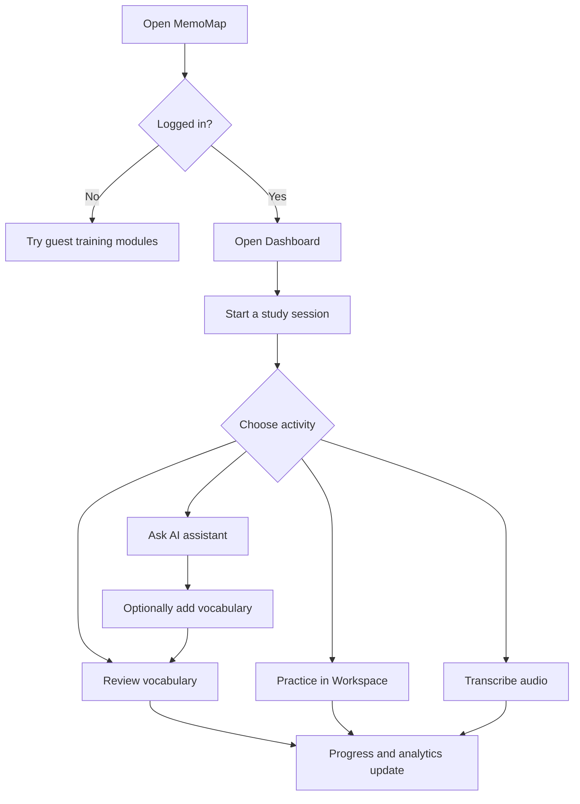
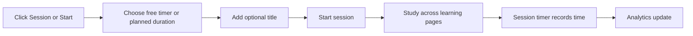
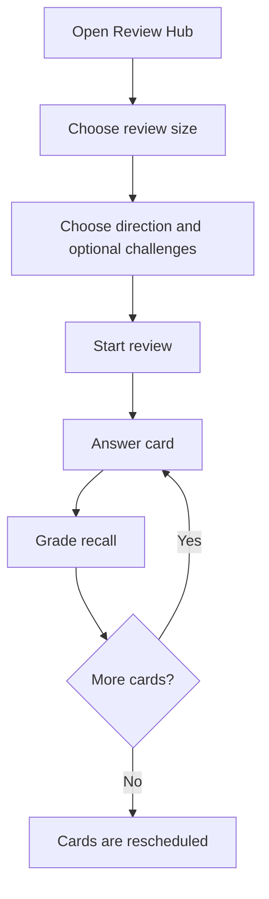
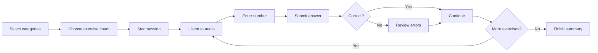
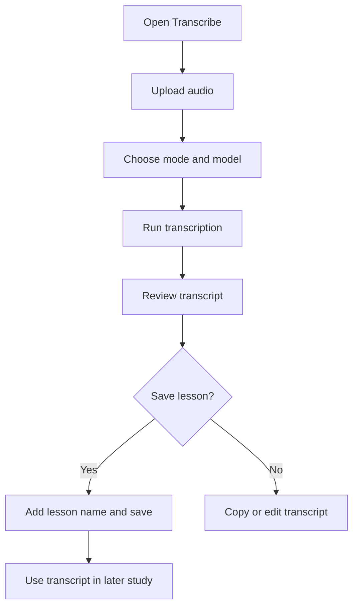
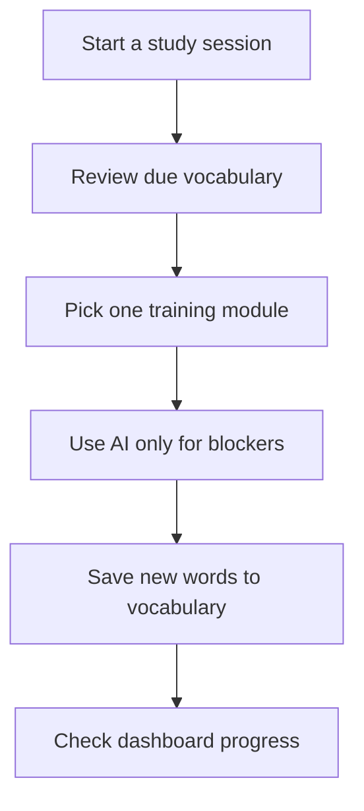

# MemoMap Learning User Guide

MemoMap is a French learning workspace that combines vocabulary review, dictation, listening and reading practice, speaking prompts, transcription, study-time tracking, and AI help in one place.

This guide explains what each feature does and how a learner can use the app.

## Who This Is For

- Learners who want a daily French study dashboard.
- Learners preparing listening, reading, speaking, or DELF-style practice.
- Learners who want to save vocabulary and review it with spaced repetition.
- Learners who want to transcribe audio and turn it into study material.

## Access Modes

| Mode | What You Can Do |
| --- | --- |
| Guest mode | Open the dashboard, use the training workspace, try numbers dictation, CO/CE practice, DELF practice, and speaking practice with limited access. |
| Logged-in mode | Save progress, manage vocabulary, review due cards, transcribe audio, save lessons, use study sessions, view analytics, and use the AI assistant. |

## Main Learning Flow

```mermaid
flowchart TD
    A["Open MemoMap"] --> B{"Logged in?"}
    B -->|"No"| C["Try guest training modules"]
    B -->|"Yes"| D["Open Dashboard"]
    D --> E["Start a study session"]
    E --> F{"Choose activity"}
    F --> G["Review vocabulary"]
    F --> H["Practice in Workspace"]
    F --> I["Transcribe audio"]
    F --> J["Ask AI assistant"]
    G --> K["Progress and analytics update"]
    H --> K
    I --> K
    J --> L["Optionally add vocabulary"]
    L --> G
```

## Dashboard

The dashboard is the home base for learning.

Use it to:

- See today's study minutes and recent activity.
- Track daily goal progress and streaks.
- Start a timed or planned study session.
- Jump quickly to Review Hub, Workspace, or Transcribe.
- Open the in-app feature guide and keyboard shortcut panel.

Recommended use: start each study block from the dashboard so your learning time is tracked.

## Study Sessions

Study sessions help you record focused learning time.

You can start:

- Free timer: begins immediately and records time as you study.
- Planned session: sets a target duration, such as 25 minutes.

Optional session titles let you add a short note about what you studied.

```mermaid
flowchart LR
    A["Click Session or Start"] --> B["Choose free timer or planned duration"]
    B --> C["Add optional title"]
    C --> D["Start session"]
    D --> E["Study across learning pages"]
    E --> F["Session timer records time"]
    F --> G["Analytics update"]
```

## Vocabulary

The Vocabulary page is where logged-in users manage their personal word list.

Use it to:

- Add new words with translations, notes, and tags.
- Search vocabulary cards.
- Filter cards by status, tag, or due date.
- Switch between list and grid views.
- Edit or delete cards.
- Start review sessions from selected vocabulary.

Each vocabulary card participates in spaced repetition, so words become due again based on how well you remember them.

## Review Hub

Review Hub is the fastest way to review due vocabulary.

Use it to:

- See how many cards are new, learning, or due for review.
- Choose review volume: 10, 20, or 50 cards.
- Pick review direction: word to translation, or translation to word.
- Filter the session by card status.
- Add an optional sentence challenge where you write a sentence using the word.
- Submit review grades so the next due date is recalculated.

```mermaid
flowchart TD
    A["Open Review Hub"] --> B["Choose review size"]
    B --> C["Choose direction and optional challenges"]
    C --> D["Start review"]
    D --> E["Answer card"]
    E --> F["Grade recall"]
    F --> G{"More cards?"}
    G -->|"Yes"| E
    G -->|"No"| H["Cards are rescheduled"]
```

## Training Workspace

The Workspace groups the main practice modules.

Available modules:

| Module | Purpose |
| --- | --- |
| Dictee | Practice listening and spelling by reconstructing text from audio or transcript material. |
| Numbers Dictation | Train recognition of French numbers in contexts such as years, prices, phone numbers, times, addresses, statistics, medical, banking, weather, transport, and quantities. |
| CO/CE Practice | Practice comprehension orale and comprehension ecrite with guided questions. |
| Speaking Practice | Practice speaking from structured topics, subtopics, and prompts. |
| DELF Practice | Practice exam-style DELF sections by level and section. |

Workspace also shows recent session activity and lightweight module progress.

## Dictee Workspace

Dictee is opened from Workspace with the "Dictee" module.

Use it to:

- Start from a fresh workspace.
- Resume a saved transcript draft when available.
- Work with lesson or transcript material.
- Practice accurate listening and written reconstruction.

Logged-in access is required because drafts and lesson data are saved.

## Numbers Dictation

Numbers Dictation trains fast recognition of numbers in spoken French.

Use it to:

- Select number categories.
- Choose the number of exercises.
- Play the audio prompt.
- Type the answer using the input field or number pad.
- Submit and see whether the answer is correct.
- Move to the next exercise or finish the session.
- Save the completed answers as transcript material when logged in.

Guest users can try a smaller session. Logged-in users can run longer sessions.

```mermaid
flowchart LR
    A["Select categories"] --> B["Choose exercise count"]
    B --> C["Start session"]
    C --> D["Listen to audio"]
    D --> E["Enter number"]
    E --> F["Submit answer"]
    F --> G{"Correct?"}
    G -->|"Yes"| H["Continue"]
    G -->|"No"| I["Review errors"]
    I --> H
    H --> J{"More exercises?"}
    J -->|"Yes"| D
    J -->|"No"| K["Finish summary"]
```

## CO/CE Practice

CO/CE Practice is for guided listening and reading comprehension.

Use it to:

- Choose a CEFR level.
- Select an exercise.
- Play or read the source content.
- Toggle the transcript when available.
- Choose comprehension orale or comprehension ecrite questions.
- Answer single-choice or multiple-choice questions.
- Submit answers and review the score.

Guest users have limited level access. Logged-in users can access the full available content.

## DELF Practice

DELF Practice provides exam-style preparation.

Use it to:

- Choose a DELF level.
- Choose a section.
- Select a test paper or exercise set.
- Work through structured exercises such as multiple choice, matching, document comprehension, subquestions, and audio-supported tasks.

This module is useful when you want a more exam-like practice format than the general workspace modules.

## Speaking Practice

Speaking Practice helps you build fluency with guided prompts.

Use it to:

- Choose a speaking topic.
- Choose a subtopic.
- Work through prompts one by one.
- Move to the next, previous, or a specific item.
- Compare your response with provided structure or model content when available.

Suggested flow: read the prompt, answer out loud, repeat with better pronunciation or structure, then move on.

## Transcribe

Transcribe turns audio into study text.

Use it to:

- Upload or drag in a supported audio file.
- Choose AI transcription mode or manual lesson mode.
- Select a local Whisper model, such as tiny or base.
- Run transcription in the browser.
- Copy the transcript.
- Edit or save the transcript as an audio lesson.
- Store the audio lesson with transcript and metadata when logged in.

Notes:

- The transcription model may need to download the first time it is used.
- WebGPU can make transcription faster when supported by the browser.
- Logged-in users can save lessons; guests can explore limited flows.

```mermaid
flowchart TD
    A["Open Transcribe"] --> B["Upload audio"]
    B --> C["Choose mode and model"]
    C --> D["Run transcription"]
    D --> E["Review transcript"]
    E --> F{"Save lesson?"}
    F -->|"Yes"| G["Add lesson name and save"]
    F -->|"No"| H["Copy or edit transcript"]
    G --> I["Use transcript in later study"]
```

## AI Assistant

The floating AI assistant is available to logged-in users across learning pages.

Use it to:

- Explain selected text or manually entered words.
- Ask chat questions about French.
- Get quick explanations.
- Request deeper breakdowns.
- Generate examples.
- Check grammar.
- Create mnemonic hints.
- Add useful words to vocabulary.

AI is best used as a helper during real practice: select a confusing word, ask for an explanation, then save it to vocabulary if you want to review it later.

## Analytics

Analytics help you see study consistency.

Tracked information includes:

- Today's study minutes.
- Average study time.
- Daily activity history.
- Current and longest streaks.
- Recent learning sessions.

To get useful analytics, start a study session before practicing.

## Community Feedback

The Community page lets users share feedback and view product ideas or requests.

Use it to:

- Read feedback from other users.
- Submit feedback.
- Post incognito if preferred.
- Edit or delete your own feedback.
- See feedback status such as planned, in progress, or done.

## Recommended Daily Routine

```mermaid
flowchart TD
    A["Start a study session"] --> B["Review due vocabulary"]
    B --> C["Pick one training module"]
    C --> D["Use AI only for blockers"]
    D --> E["Save new words to vocabulary"]
    E --> F["Check dashboard progress"]
```

A simple 30-minute routine:

1. Spend 5 minutes in Review Hub.
2. Spend 15-20 minutes in one Workspace module.
3. Use the AI assistant for difficult words or grammar.
4. Add important words to Vocabulary.
5. Finish by checking your dashboard progress.

## Feature Access Summary

| Feature | Guest | Logged In |
| --- | --- | --- |
| Dashboard | Yes | Yes |
| Training Workspace | Yes | Yes |
| Numbers Dictation | Limited | Full |
| CO/CE Practice | Limited | Full available content |
| DELF Practice | Limited | Full available content |
| Speaking Practice | Yes | Yes |
| Vocabulary management | No | Yes |
| Review Hub | No | Yes |
| Transcribe and save lessons | No | Yes |
| Study session timer | No | Yes |
| Analytics and streaks | No | Yes |
| AI assistant | No | Yes |
| Community feedback | Requires account for posting ownership | Yes |

## Troubleshooting

| Problem | What To Try |
| --- | --- |
| A feature is locked | Log in to save progress and unlock authenticated features. |
| Transcription is slow | Use a smaller model, wait for the model to cache, or use a browser/device with WebGPU support. |
| No vocabulary appears in Review Hub | Add vocabulary first, or wait until cards become due. |
| Practice content is limited | Guest mode exposes only a limited set of content. Log in for full available access. |
| Analytics look empty | Start a study session before practicing so time can be tracked. |

## Glossary

| Term | Meaning |
| --- | --- |
| SRS | Spaced repetition system. Cards return for review based on how well you remember them. |
| CO | Comprehension orale, or listening comprehension. |
| CE | Comprehension ecrite, or reading comprehension. |
| DELF | Official French language diploma format used for exam-style practice. |
| Dictee | Dictation practice: listen, write, compare, and improve. |
