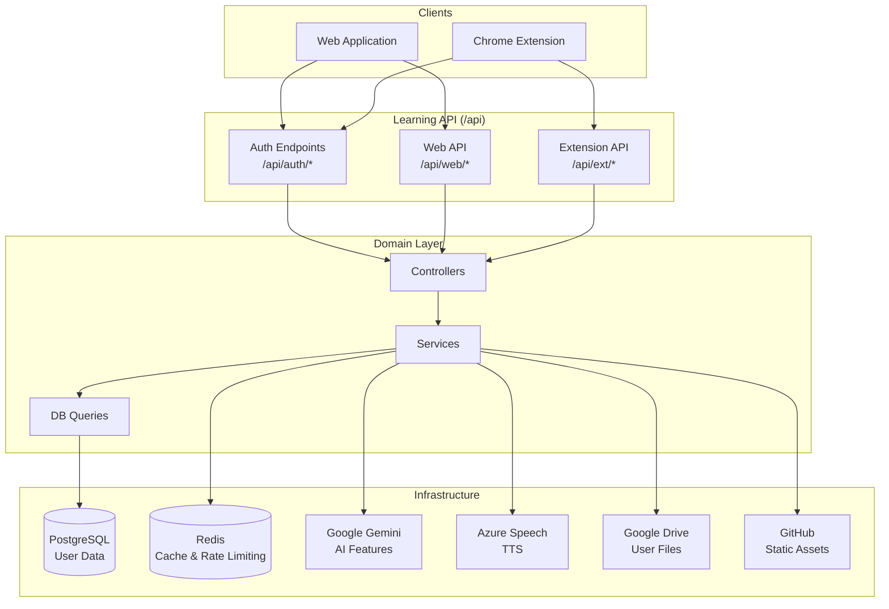
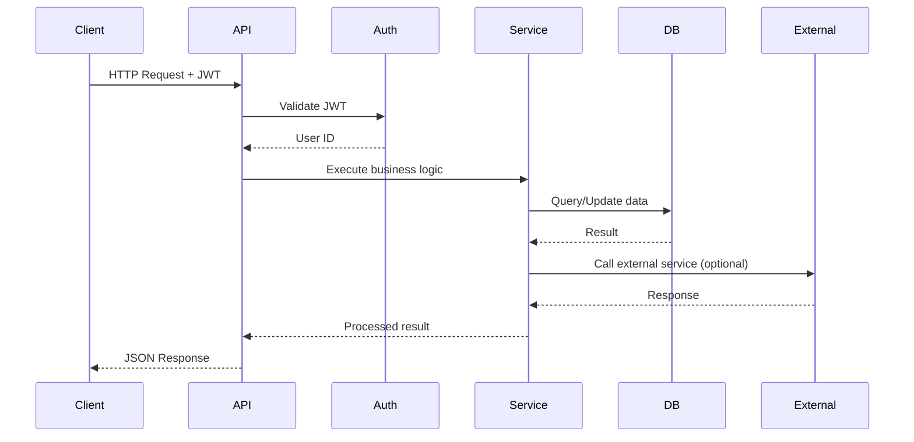
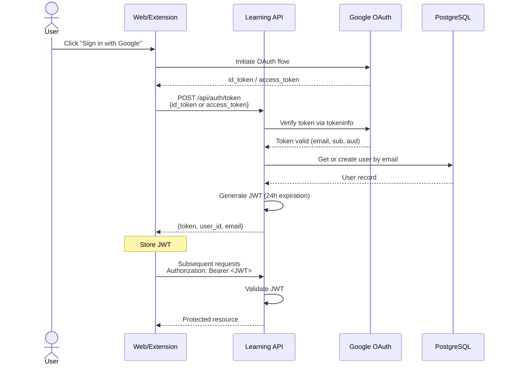
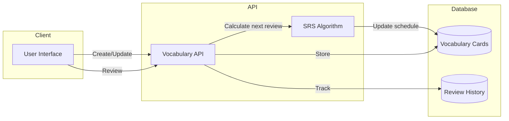
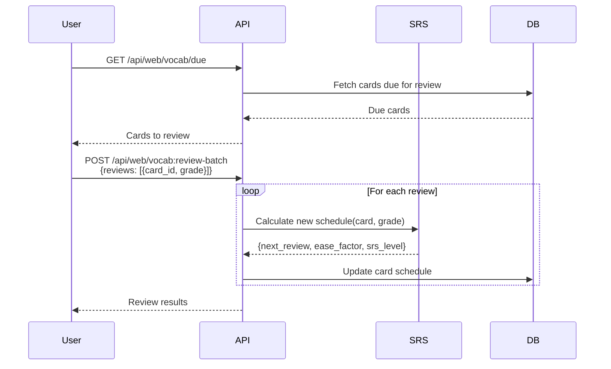
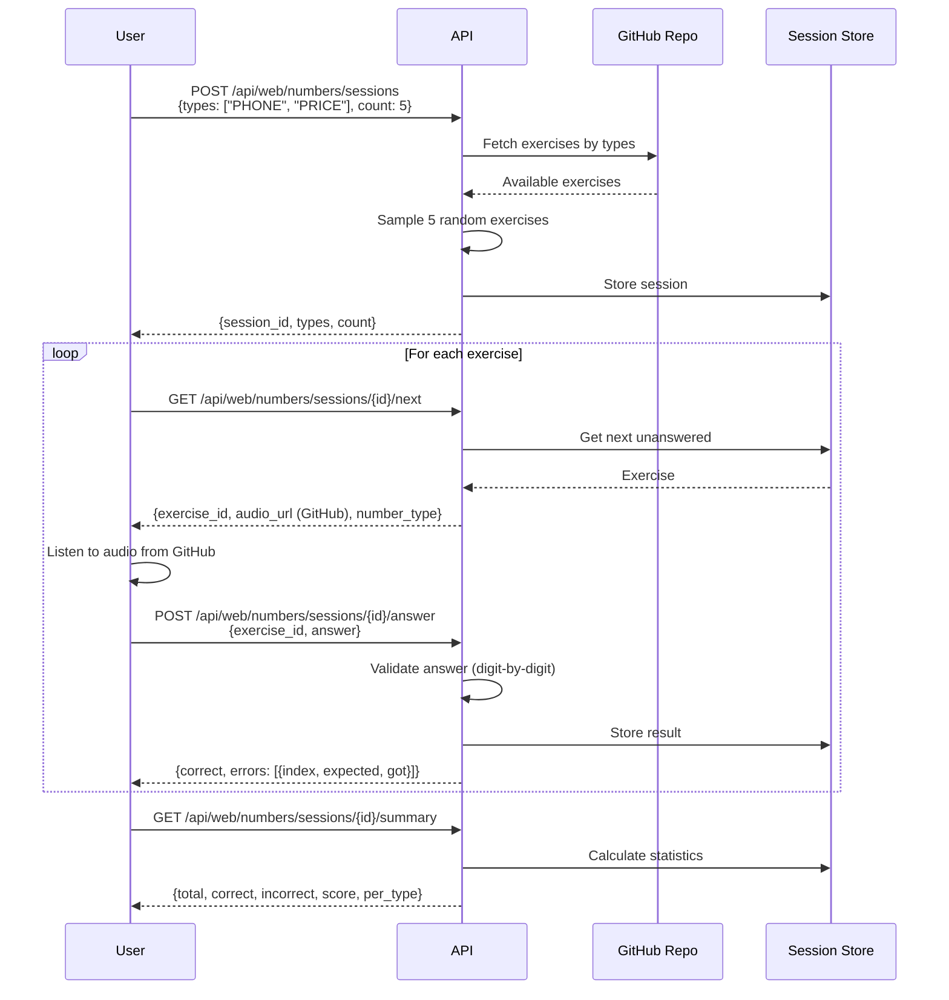
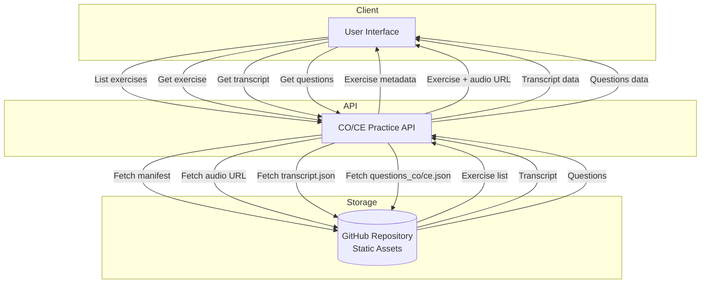
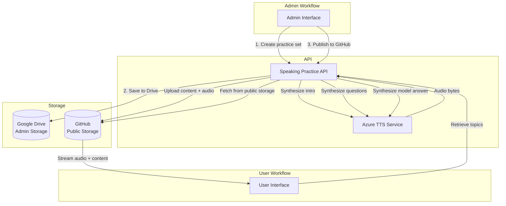
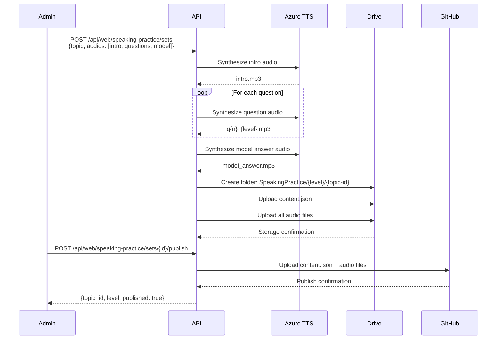
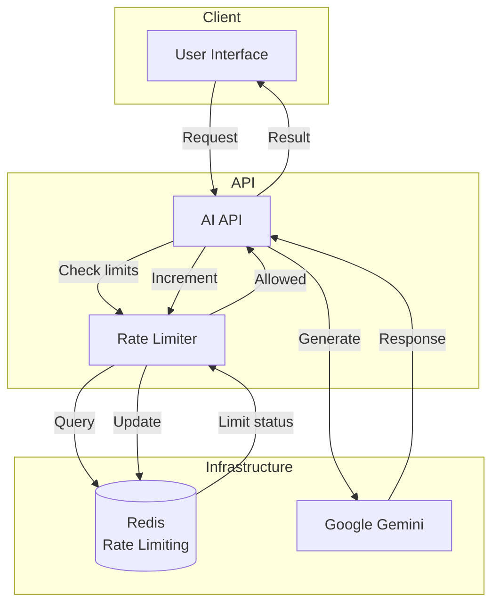

# 🎓 MemoMap Learning Backend

> A comprehensive language learning platform backend with vocabulary management, spaced repetition, audio lessons, AI-powered features, and practice exercises.

[](https://www.python.org/downloads/)
[](https://flask.palletsprojects.com/)
[](https://www.postgresql.org/)
[](https://redis.io/)

---

## 📋 Table of Contents

- [Overview](#-overview)
- [Technology Stack](#technology-stack)
- [Architecture & Workflows](#-architecture--workflows)
  - [System Architecture](#system-architecture)
  - [Project Structure](#project-structure)
  - [Data Flow](#data-flow)
- [Authentication](#-authentication)
- [Endpoint Roles](#-endpoint-roles)
  - [Admin Endpoints](#admin-endpoints)
  - [User Endpoints](#user-endpoints)
- [Business Logic & Features](#-business-logic--features)
  - [Vocabulary Management (SRS)](#vocabulary-management)
  - [Numbers Dictation](#numbers-dictation)
  - [Audio Lessons](#audio-lessons)
  - [CO/CE Practice](#coce-practice-comprehension-exercises)
  - [Speaking Practice](#speaking-practice)
  - [AI Features](#ai-features)
  - [Learning Sessions](#learning-sessions)
  - [Transcripts](#transcripts)
  - [Analytics](#analytics)
- [Error Handling](#-error-handling)
- [Rate Limiting](#-rate-limiting)

---

## 🌟 Overview

**MemoMap Learning Backend** is a unified API serving both web applications and Chrome extensions for language learning. It provides a complete suite of tools for vocabulary acquisition, listening comprehension, speaking practice, and AI-powered language assistance.

### Key Capabilities

- 📚 **Vocabulary Management** - SRS-based flashcard system with intelligent review scheduling
- 🔢 **Numbers Dictation** - Practice understanding numbers in context with real audio
- 🎧 **Audio Lessons** - Upload, generate (TTS), and practice with audio content
- 📖 **CO/CE Practice** - Compréhension Orale/Écrite exercises with questions
- 🗣️ **Speaking Practice** - Structured speaking exercises with model answers
- 🤖 **AI Tutor** - Powered by Google Gemini for explanations and chat
- 📊 **Analytics** - Track learning progress and statistics
- ⏱️ **Session Tracking** - Monitor study time and activities

### Technology Stack

| Component | Technology |
|-----------|------------|
| **Framework** | Flask 3.0+ |
| **Database** | PostgreSQL 15+ |
| **Cache** | Redis 7+ |
| **AI** | Google Gemini |
| **TTS** | Azure Speech Services |
| **Storage** | Google Drive (user files) |
| **Auth** | JWT + Google OAuth 2.0 |
| **Language** | Python 3.11+ |

---

## ✨ Features

### 🎯 Core Learning Features

1. **Spaced Repetition System (SRS)**
   - SM-2 algorithm for optimal review scheduling
   - Customizable ease factors and intervals
   - Statistics and progress tracking

2. **Numbers Dictation**
   - Pre-generated exercises with native speaker audio
   - Multiple number types: phone, price, year, time
   - Real-time answer validation with detailed feedback

3. **Audio Lessons**
   - Upload custom audio with transcripts
   - Generate lessons from text using Azure TTS
   - Multi-speaker conversation synthesis
   - Attach comprehension questions (CO/CE)

4. **Comprehension Practice (CO/CE)**
   - Listening (CO) and reading (CE) exercises
   - Multiple question types: single choice, inference, lexical
   - Level-based organization (A1-C2)

5. **Speaking Practice**
   - Topic-based speaking exercises
   - Progressive difficulty (warmup → opinion → nuance)
   - Model answers for comparison
   - Timed speaking segments

### 🤖 AI-Powered Features

- **Text Explanation** - Detailed grammar and vocabulary breakdowns
- **AI Chat Tutor** - Conversational learning assistant
- **Rate Limiting** - Per-user and global limits to manage API costs

### 📊 Tracking & Analytics

- Learning session duration tracking
- Vocabulary review statistics
- Progress analytics by language
- Daily/weekly activity summaries


## 🏗️ Architecture & Workflows

### System Architecture



### Project Structure

```
backend/
├── src/
│   ├── api/                    # HTTP Layer
│   │   ├── auth/              # Authentication endpoints
│   │   ├── web/               # Web API endpoints
│   │   └── ext/               # Extension API endpoints
│   ├── domain/                 # Business Logic
│   │   ├── controllers/       # Request handlers
│   │   ├── services/          # Business services
│   │   └── db_queries/        # Database queries
│   ├── infra/                  # Infrastructure
│   │   ├── db/                # PostgreSQL connection
│   │   ├── cache/             # Redis client
│   │   ├── ai/                # Gemini integration
│   │   ├── tts/               # Azure Speech
│   │   ├── drive/             # Google Drive client
│   │   └── auth/              # JWT & OAuth
│   ├── shared/                 # Shared Features
│   │   ├── numbers/           # Numbers dictation
│   │   ├── coce_practice/     # CO/CE exercises
│   │   └── drive_services/    # Drive operations
│   └── utils/                  # Utilities
├── alembic/                    # Database migrations
├── run.py                      # Application entry point
└── README.md                   # This file
```

### Data Flow



---

## 🔐 Authentication

All endpoints (except `/api/health` and `/api/auth/token`) require authentication using JWT Bearer tokens.

### Authentication Flow



### Auth Endpoints

#### `POST /api/auth/token`

Exchange a Google OAuth token for an application JWT.

**Request:**
```json
{
  "id_token": "google_id_token_here",
  "access_token": "google_access_token_here"  // Alternative
}
```

**Response (201):**
```json
{
  "status": "success",
  "data": {
    "token": "eyJhbGciOiJIUzI1NiIsInR5cCI6IkpXVCJ9...",
    "user_id": "550e8400-e29b-41d4-a716-446655440000",
    "email": "user@example.com"
  }
}
```

**Token Expiration:** 24 hours (86400 seconds)

#### `GET /api/auth/verify`

Verify JWT token validity.

**Headers:**
```http
Authorization: Bearer <jwt>
```

**Response (200):**
```json
{
  "status": "success",
  "data": {
    "valid": true,
    "user": {
      "sub": "550e8400-e29b-41d4-a716-446655440000",
      "email": "user@example.com"
    }
  }
}
```

#### `GET /api/auth/me`

Get current authenticated user information.

**Headers:**
```http
Authorization: Bearer <jwt>
```

**Response (200):**
```json
{
  "status": "success",
  "data": {
    "user_id": "550e8400-e29b-41d4-a716-446655440000",
    "email": "user@example.com",
    "created_at": "2024-01-15T10:30:00Z"
  }
}
```

### Drive-Backed Endpoints

Some endpoints require **two tokens** for Google Drive access:

1. **App JWT** - `Authorization: Bearer <jwt>`
2. **Google Access Token** - `X-Google-Access-Token: <token>`

**Required headers:**
```http
Authorization: Bearer <app-jwt>
X-Google-Access-Token: <google-oauth-token-with-drive-scope>
```

**Endpoints requiring Drive access:**
- `POST /api/web/audio-lessons`
- `GET /api/web/audio-lessons`
- `GET /api/web/audio-lessons/{id}/transcript`
- `GET /api/web/audio-lessons/{id}/audio`
- `POST /api/web/audio-lessons/{id}/questions`
- `POST /api/web/speaking-practice/sets`
- `POST /api/web/numbers/admin/*` (also requires admin token)

**OAuth Scope Required:**
```
https://www.googleapis.com/auth/drive.file
```

---

## 🎭 Endpoint Roles

The API is designed with clear separation between **Admin** and **User** roles. Admin endpoints are used to create and manage learning content (datasets, audio, exercises), while User endpoints allow learners to interact with and consume this content.

### Admin Endpoints

**Purpose:** Content creation and dataset management for practice exercises

#### Numbers Dictation - Admin

| Method | Endpoint | Description |
|--------|----------|-------------|
| POST | `/web/numbers/admin/generate` | Generate new number dictation exercises |
| POST | `/web/numbers/admin/upload` | Upload pre-generated exercise datasets |
| DELETE | `/web/numbers/admin/exercises/{id}` | Remove exercise from pool |

**Requirements:**
- JWT authentication
- Google Drive access token (for storage)
- Admin privileges

**Use Case:** Administrators generate batches of number dictation exercises (phone numbers, prices, years, times) with native speaker audio and upload them to the exercise pool.

#### Audio Lessons - Admin

| Method | Endpoint | Description |
|--------|----------|-------------|
| POST | `/web/audio-lessons` | Upload custom audio lesson with transcript |
| POST | `/web/audio-lessons/tts` | Generate lesson from text using TTS |
| POST | `/web/audio-lessons/conversation` | Generate multi-speaker conversation |
| POST | `/web/audio-lessons/{id}/questions` | Attach CO/CE questions to lesson |

**Requirements:**
- JWT authentication
- Google Drive access token

**Use Case:** Create audio learning materials with transcripts and comprehension questions. Supports both uploaded audio and TTS-generated content.

#### Speaking Practice - Admin

| Method | Endpoint | Description |
|--------|----------|-------------|
| POST | `/web/speaking-practice/sets` | Create speaking practice topic set |
| PUT | `/web/speaking-practice/sets/{id}` | Update practice set |
| DELETE | `/web/speaking-practice/sets/{id}` | Remove practice set |

**Requirements:**
- JWT authentication
- Google Drive access token

**Use Case:** Create structured speaking exercises with progressive difficulty (warmup → opinion → nuance) including intro audio, questions, and model answers.

#### CO/CE Practice - Admin

| Method | Endpoint | Description |
|--------|----------|-------------|
| POST | `/web/coce/admin/exercises` | Create new CO/CE exercise |
| PUT | `/web/coce/admin/exercises/{id}` | Update exercise content |
| POST | `/web/coce/admin/exercises/{id}/publish` | Publish to GitHub repository |
| DELETE | `/web/coce/admin/exercises/{id}` | Remove exercise |

**Requirements:**
- JWT authentication
- GitHub access (for publishing)

**Use Case:** Create comprehension exercises (listening/reading) with questions, then publish to static hosting for user access.

---

### User Endpoints

**Purpose:** Interact with learning content and track progress

#### Vocabulary Management - User

| Method | Endpoint | Description |
|--------|----------|-------------|
| GET | `/web/vocab` | List personal vocabulary cards |
| POST | `/web/vocab` | Create new vocabulary card |
| GET | `/web/vocab/{id}` | Get specific card |
| PATCH | `/web/vocab/{id}` | Update card |
| DELETE | `/web/vocab/{id}` | Suspend card |
| GET | `/web/vocab/due` | Get cards due for review |
| POST | `/web/vocab:review-batch` | Submit review results |
| GET | `/web/vocab/stats` | Get learning statistics |

**Use Case:** Users manage their personal vocabulary flashcards with spaced repetition (SRS) for optimal learning.

#### Numbers Dictation - User

| Method | Endpoint | Description |
|--------|----------|-------------|
| POST | `/web/numbers/sessions` | Create practice session |
| GET | `/web/numbers/sessions/{id}/next` | Get next exercise |
| POST | `/web/numbers/sessions/{id}/answer` | Submit answer |
| GET | `/web/numbers/sessions/{id}/summary` | Get session results |
| GET | `/web/numbers/audio/{ref}` | Stream exercise audio |

**Use Case:** Users practice understanding spoken numbers through interactive sessions with immediate feedback.

#### Audio Lessons - User

| Method | Endpoint | Description |
|--------|----------|-------------|
| GET | `/web/audio-lessons` | List available lessons |
| GET | `/web/audio-lessons/{id}/transcript` | Get lesson transcript |
| GET | `/web/audio-lessons/{id}/audio` | Stream lesson audio |

**Use Case:** Users access audio lessons with transcripts for listening comprehension practice.

#### CO/CE Practice - User

| Method | Endpoint | Description |
|--------|----------|-------------|
| GET | `/web/coce/exercises?level={level}` | List exercises by level |
| GET | `/web/coce/exercises/{id}?level={level}` | Get exercise with audio URL |
| GET | `/web/coce/exercises/{id}/transcript?level={level}` | Get transcript |
| GET | `/web/coce/exercises/{id}/questions?level={level}&type={co\|ce}` | Get questions |

**Use Case:** Users practice listening (CO) or reading (CE) comprehension with level-appropriate exercises (A1-C2).

#### Speaking Practice - User

| Method | Endpoint | Description |
|--------|----------|-------------|
| GET | `/web/speaking-practice/topics?level={level}` | List available topics |
| GET | `/web/speaking-practice/topics/{id}` | Get topic with questions |
| GET | `/web/speaking-practice/topics/{id}/audio/{file}` | Stream audio files |

**Use Case:** Users practice speaking with structured prompts and can compare with model answers.

#### AI Features - User

| Method | Endpoint | Description |
|--------|----------|-------------|
| POST | `/web/ai/explain` | Get AI explanation of text |
| POST | `/web/ai/chat` | Chat with AI language tutor |

**Use Case:** Users get instant explanations and conversational practice with AI assistance.

#### Learning Sessions - User

| Method | Endpoint | Description |
|--------|----------|-------------|
| GET | `/web/sessions` | List learning sessions |
| POST | `/web/sessions` | Create session record |
| GET | `/web/sessions/{id}` | Get session details |

**Use Case:** Track study time and activities for progress monitoring.

#### Transcripts - User

| Method | Endpoint | Description |
|--------|----------|-------------|
| GET | `/web/transcripts` | List saved transcripts |
| POST | `/web/transcripts` | Save new transcript |
| GET | `/web/transcripts/{id}` | Get transcript |
| PUT | `/web/transcripts/{id}` | Update transcript |
| DELETE | `/web/transcripts/{id}` | Delete transcript |

**Use Case:** Manage transcripts and notes from various learning materials.

#### Analytics - User

| Method | Endpoint | Description |
|--------|----------|-------------|
| GET | `/web/analytics?language={lang}&days={n}` | Get learning statistics |

**Use Case:** View progress metrics, study time, and performance analytics.

---

## 📚 Business Logic & Features

Base URL: `/api`

All endpoints return JSON in this format:

**Success Response:**
```json
{
  "status": "success",
  "data": { ... }
}
```

**Error Response:**
```json
{
  "status": "error",
  "message": "Human-readable error message"
}
```

---

## Vocabulary Management

Spaced Repetition System (SRS) for vocabulary learning with SM-2 algorithm.

### Architecture



### Workflow



### Endpoints

| Method | Endpoint | Description |
|--------|----------|-------------|
| GET | `/web/vocab` | List vocabulary cards |
| POST | `/web/vocab` | Create vocabulary card |
| GET | `/web/vocab/{id}` | Get vocabulary card |
| PATCH | `/web/vocab/{id}` | Update vocabulary card |
| DELETE | `/web/vocab/{id}` | Soft delete (suspend) card |
| DELETE | `/web/vocab/{id}/hard` | Permanently delete card |
| GET | `/web/vocab/due` | Get due cards for review |
| POST | `/web/vocab:review-batch` | Submit batch review results |
| GET | `/web/vocab/stats` | Get vocabulary statistics |

### Examples

#### Create Vocabulary Card

**Request:**
```http
POST /api/web/vocab
Authorization: Bearer <jwt>
Content-Type: application/json

{
  "language": "fr",
  "word": "bonjour",
  "translation": "hello",
  "notes": ["Used in formal settings", "Common greeting"],
  "tags": ["greetings", "basic"],
  "extra": {
    "pronunciation": "bɔ̃ʒuʁ",
    "example": "Bonjour, comment allez-vous?"
  }
}
```

**Response (201):**
```json
{
  "status": "success",
  "data": {
    "id": "550e8400-e29b-41d4-a716-446655440000",
    "language": "fr",
    "word": "bonjour",
    "translation": "hello",
    "notes": ["Used in formal settings", "Common greeting"],
    "tags": ["greetings", "basic"],
    "srs_level": 0,
    "ease_factor": 2.5,
    "next_review": "2024-01-15T10:30:00Z",
    "created_at": "2024-01-15T10:30:00Z",
    "extra": {
      "pronunciation": "bɔ̃ʒuʁ",
      "example": "Bonjour, comment allez-vous?"
    }
  }
}
```

#### Get Due Cards

**Request:**
```http
GET /api/web/vocab/due?limit=20
Authorization: Bearer <jwt>
```

**Response (200):**
```json
{
  "status": "success",
  "data": {
    "cards": [
      {
        "id": "550e8400-e29b-41d4-a716-446655440000",
        "word": "bonjour",
        "translation": "hello",
        "srs_level": 3,
        "ease_factor": 2.5,
        "last_reviewed": "2024-01-10T10:00:00Z",
        "next_review": "2024-01-15T10:00:00Z"
      }
    ],
    "count": 15,
    "total_due": 15
  }
}
```

#### Submit Review Batch

**Request:**
```http
POST /api/web/vocab:review-batch
Authorization: Bearer <jwt>
Content-Type: application/json

{
  "reviews": [
    {
      "card_id": "550e8400-e29b-41d4-a716-446655440000",
      "grade": "good"
    },
    {
      "card_id": "660e8400-e29b-41d4-a716-446655440001",
      "grade": "easy"
    },
    {
      "card_id": "770e8400-e29b-41d4-a716-446655440002",
      "grade": "again"
    }
  ]
}
```

**Grade values:** `"again"`, `"hard"`, `"good"`, `"easy"`

**Response (200):**
```json
{
  "status": "success",
  "data": {
    "reviewed": 3,
    "results": [
      {
        "card_id": "550e8400-e29b-41d4-a716-446655440000",
        "srs_level": 4,
        "next_review": "2024-01-20T10:00:00Z"
      },
      {
        "card_id": "660e8400-e29b-41d4-a716-446655440001",
        "srs_level": 5,
        "next_review": "2024-01-25T10:00:00Z"
      },
      {
        "card_id": "770e8400-e29b-41d4-a716-446655440002",
        "srs_level": 2,
        "next_review": "2024-01-16T10:00:00Z"
      }
    ]
  }
}
```

#### Get Statistics

**Request:**
```http
GET /api/web/vocab/stats?language=fr
Authorization: Bearer <jwt>
```

**Response (200):**
```json
{
  "status": "success",
  "data": {
    "total_cards": 150,
    "cards_by_level": {
      "0": 10,
      "1": 25,
      "2": 40,
      "3": 35,
      "4": 25,
      "5": 15
    },
    "due_today": 12,
    "reviewed_today": 8,
    "new_cards_today": 3,
    "retention_rate": 0.85
  }
}
```

---

## Numbers Dictation

**Admin Workflow:** Admins generate number dictation exercises (phone, price, year, time) with native speaker audio, save to Google Drive, then publish to GitHub as public storage.

**User Workflow:** Users practice understanding spoken numbers through interactive sessions, accessing exercises from GitHub.

### Architecture

```mermaid
flowchart TB
    subgraph Admin["Admin Workflow"]
        AdminUI[Admin Interface]
        Generator[Exercise Generator]
    end
    
    subgraph User["User Workflow"]
        UserUI[User Interface]
        SessionAPI[Session API]
        Validator[Answer Validator]
    end
    
    subgraph Storage
        Drive[(Google Drive<br/>Admin Storage)]
        GitHub[(GitHub Repository<br/>Public Storage)]
        Memory[(In-Memory<br/>Active Sessions)]
    end
    
    AdminUI -->|1. Generate exercises| Generator
    Generator -->|2. Save datasets| Drive
    AdminUI -->|3. Publish to GitHub| GitHub
    
    UserUI -->|Create session| SessionAPI
    SessionAPI -->|Sample exercises| GitHub
    GitHub -->|Exercises + Audio| SessionAPI
    SessionAPI -->|Create session| Memory
    
    UserUI -->|Get next exercise| SessionAPI
    SessionAPI -->|Retrieve| Memory
    Memory -->|Exercise| SessionAPI
    SessionAPI -->|Audio URL (GitHub)| UserUI
    
    UserUI -->|Submit answer| SessionAPI
    SessionAPI -->|Validate| Validator
    Validator -->|Result| SessionAPI
    SessionAPI -->|Update| Memory
```

### User Practice Workflow



### Number Types

| Type | Description | Example |
|------|-------------|---------|
| `PHONE` | French phone numbers | 06 20 01 53 31 |
| `PRICE` | Prices in euros | 44,31 € |
| `YEAR` | Years | 1998 |
| `TIME` | Time expressions | 14h30 |

### Storage Layout

#### Google Drive (Admin Storage)

```
MemoMap/
└── LearningTracker/
    └── NumbersDictation/
        └── {version}/                (e.g., 2025-W50)
            ├── datasets/
            │   ├── phone.json
            │   ├── price.json
            │   ├── year.json
            │   └── time.json
            └── audio/
                ├── phone_0620015331.mp3
                ├── price_4431.mp3
                └── ...
```

#### GitHub (Public Storage for Users)

```
{BASE_URL}/number-dictation/{version}/
├── datasets/
│   ├── phone.json
│   ├── price.json
│   ├── year.json
│   └── time.json
└── audio/
    ├── phone_0620015331.mp3
    ├── price_4431.mp3
    └── ...
```

### Endpoints

#### Admin Endpoints

| Method | Endpoint | Description | Role |
|--------|----------|-------------|------|
| POST | `/web/numbers/admin/generate` | Generate exercise datasets | Admin |
| POST | `/web/numbers/admin/upload` | Upload to Drive | Admin |
| POST | `/web/numbers/admin/publish` | Publish to GitHub | Admin |
| DELETE | `/web/numbers/admin/exercises/{id}` | Remove exercise | Admin |

**Requirements:** JWT + Google Drive access token + GitHub access

#### User Endpoints

| Method | Endpoint | Description | Role |
|--------|----------|-------------|------|
| POST | `/web/numbers/sessions` | Create practice session | User |
| GET | `/web/numbers/sessions/{id}/next` | Get next exercise | User |
| POST | `/web/numbers/sessions/{id}/answer` | Submit answer | User |
| GET | `/web/numbers/sessions/{id}/summary` | Get session summary | User |
| GET | `/web/numbers/audio/{ref}` | Stream audio from GitHub | User |

**Requirements:** JWT authentication

### Examples

#### Create Session

**Request:**
```http
POST /api/web/numbers/sessions
Authorization: Bearer <jwt>
Content-Type: application/json

{
  "types": ["PHONE", "PRICE", "YEAR"],
  "count": 10
}
```

**Response (201):**
```json
{
  "status": "success",
  "data": {
    "session_id": "550e8400-e29b-41d4-a716-446655440000",
    "types": ["PHONE", "PRICE", "YEAR"],
    "count": 10
  }
}
```

#### Get Next Exercise

**Request:**
```http
GET /api/web/numbers/sessions/550e8400-e29b-41d4-a716-446655440000/next
Authorization: Bearer <jwt>
```

**Response (200):**
```json
{
  "status": "success",
  "data": {
    "exercise_id": "ex-550e8400-e29b-41d4-a716-446655440001",
    "number_type": "PHONE",
    "audio_ref": "number-dictation/2025-W50/audio/phone_0620015331.mp3",
    "audio_url": "https://raw.githubusercontent.com/.../phone_0620015331.mp3"
  }
}
```

**When session complete:**
```json
{
  "status": "success",
  "data": {
    "completed": true,
    "summary": {
      "session_id": "550e8400-e29b-41d4-a716-446655440000",
      "total_exercises": 10,
      "answered": 10,
      "correct": 8,
      "incorrect": 2,
      "score": 0.8,
      "per_type": [
        {
          "number_type": "PHONE",
          "total": 4,
          "correct": 3,
          "incorrect": 1
        },
        {
          "number_type": "PRICE",
          "total": 3,
          "correct": 3,
          "incorrect": 0
        },
        {
          "number_type": "YEAR",
          "total": 3,
          "correct": 2,
          "incorrect": 1
        }
      ]
    }
  }
}
```

#### Submit Answer

**Request:**
```http
POST /api/web/numbers/sessions/550e8400-e29b-41d4-a716-446655440000/answer
Authorization: Bearer <jwt>
Content-Type: application/json

{
  "exercise_id": "ex-550e8400-e29b-41d4-a716-446655440001",
  "answer": "0620015331"
}
```

**Response (200) - Correct:**
```json
{
  "status": "success",
  "data": {
    "exercise_id": "ex-550e8400-e29b-41d4-a716-446655440001",
    "correct": true,
    "errors": []
  }
}
```

**Response (200) - Incorrect:**
```json
{
  "status": "success",
  "data": {
    "exercise_id": "ex-550e8400-e29b-41d4-a716-446655440001",
    "correct": false,
    "errors": [
      {
        "index": 3,
        "expected": "0",
        "got": "5"
      },
      {
        "index": 7,
        "expected": "5",
        "got": "0"
      }
    ]
  }
}
```

---

## Audio Lessons

**Admin Workflow:** Admins create audio lessons (upload or TTS-generated), save to Google Drive, then publish to GitHub as public storage for shared learning content.

**User Workflow (Two Modes):**
1. **Learning Practice**: Access published audio lessons from GitHub for listening comprehension
2. **Personal Dictation**: Upload own audio files (manually or via Whisper AI transcription) to personal Drive storage for dictation practice in the dictation workspace

### Architecture

```mermaid
flowchart TB
    subgraph Admin["Admin Workflow"]
        AdminUI[Admin Interface]
    end
    
    subgraph User["User Workflow"]
        UserUI[User Interface]
        Whisper[Whisper AI<br/>Transcription]
    end
    
    subgraph API
        LessonAPI[Audio Lessons API]
        TTS[Azure TTS Service]
    end
    
    subgraph Storage
        AdminDrive[(Google Drive<br/>Admin Storage)]
        UserDrive[(Google Drive<br/>User Personal Storage)]
        GitHub[(GitHub<br/>Public Storage)]
    end
    
    %% Admin workflow
    AdminUI -->|1. Upload audio + transcript| LessonAPI
    AdminUI -->|1. Generate from text (TTS)| LessonAPI
    LessonAPI -->|Synthesize| TTS
    TTS -->|Audio bytes| LessonAPI
    LessonAPI -->|2. Save to Drive| AdminDrive
    
    AdminUI -->|3. Attach questions| LessonAPI
    LessonAPI -->|Store questions_co/ce.json| AdminDrive
    
    AdminUI -->|4. Publish to GitHub| LessonAPI
    LessonAPI -->|Upload autoAudio| GitHub
    
    %% User workflow - Learning
    UserUI -->|Retrieve published lessons| LessonAPI
    LessonAPI -->|Fetch from public storage| GitHub
    GitHub -->|Stream audio + transcript| UserUI
    
    %% User workflow - Personal Dictation
    UserUI -->|Upload personal audio| LessonAPI
    UserUI -->|Upload + transcribe (Whisper)| Whisper
    Whisper -->|Transcript| LessonAPI
    LessonAPI -->|Save to personal storage| UserDrive
    UserUI -->|Fetch for dictation practice| LessonAPI
    LessonAPI -->|Retrieve| UserDrive
```

### Storage Layout

#### Google Drive - Admin Storage

```
MemoMap/
└── LearningTracker/
    └── AudioLessons/
        ├── {lesson-id}/              (Uploaded audio)
        │   ├── audio.mp3
        │   ├── transcript.json
        │   ├── questions_co.json  (optional)
        │   └── questions_ce.json  (optional)
        └── autoAudio/                (TTS-generated by Admin)
            └── {lesson-id}/
                ├── audio.mp3
                ├── transcript.json
                ├── questions_co.json
                └── questions_ce.json
```

#### Google Drive - User Personal Storage

```
MemoMap/
└── LearningTracker/
    └── AudioLessons/
        └── {lesson-id}/              (User's personal uploads)
            ├── audio.mp3             (Manual upload or Whisper)
            └── transcript.json       (Manual or Whisper AI)
```

**Use Case**: Users upload their own audio files (podcasts, videos, etc.) with transcripts for dictation practice in the dictation workspace.

#### GitHub (Public Storage for Users)

```
{BASE_URL}/audio-lessons/
└── autoAudio/                    (Published by Admin)
    └── {lesson-id}/
        ├── audio.mp3
        ├── transcript.json
        ├── questions_co.json
        └── questions_ce.json
```

### Endpoints

#### Admin Endpoints

| Method | Endpoint | Description | Role |
|--------|----------|-------------|------|
| POST | `/web/audio-lessons` | Upload audio lesson | Admin |
| POST | `/web/audio-lessons/tts` | Generate lesson from text (TTS) | Admin |
| POST | `/web/audio-lessons/conversation` | Generate conversation lesson | Admin |
| POST | `/web/audio-lessons/{id}/questions` | Attach CO/CE questions | Admin |
| POST | `/web/audio-lessons/{id}/publish` | Publish to GitHub (autoAudio) | Admin |

**Requirements:** JWT + Google Drive access token (+ GitHub access for publish)

#### User Endpoints

| Method | Endpoint | Description | Role |
|--------|----------|-------------|------|
| GET | `/web/audio-lessons` | List published lessons (GitHub) | User |
| POST | `/web/audio-lessons` | Upload personal audio for dictation | User |
| GET | `/web/audio-lessons/{id}/transcript` | Get transcript (GitHub or personal) | User |
| GET | `/web/audio-lessons/{id}/audio` | Stream audio (GitHub or personal) | User |

**Requirements:** 
- JWT authentication
- Google Drive access token (for personal uploads)

**Note**: Users can upload their own audio files (manually or via Whisper AI transcription) to their personal Drive storage for dictation practice. These are stored separately from admin-published content.

### Examples

#### Upload Audio Lesson

**Request:**
```http
POST /api/web/audio-lessons
Authorization: Bearer <jwt>
X-Google-Access-Token: <google-token>
Content-Type: multipart/form-data

audio: <audio-file.mp3>
transcript: "Full transcript text here..."
language: "fr"
name: "French News Article"
duration: "180.5"
```

**Response (201):**
```json
{
  "status": "success",
  "data": {
    "lesson_id": "a92a32f7-ca13-4129-9f82-49fefc35329b",
    "folder_id": "drive-folder-id",
    "audio_file": {
      "id": "drive-audio-file-id",
      "name": "audio.mp3"
    },
    "transcript_file": {
      "id": "drive-transcript-file-id",
      "name": "transcript.json"
    }
  }
}
```

#### Generate Lesson from Text (TTS)

**Request:**
```http
POST /api/web/audio-lessons/tts
Authorization: Bearer <jwt>
X-Google-Access-Token: <google-token>
Content-Type: application/json

{
  "text": "Bonjour et bienvenue dans cette leçon de français. Aujourd'hui, nous allons parler de la culture française.",
  "language": "fr",
  "name": "Introduction to French Culture",
  "voice": "fr-FR-DeniseNeural"
}
```

**Response (201):**
```json
{
  "status": "success",
  "data": {
    "lesson_id": "b92a32f7-ca13-4129-9f82-49fefc35329c",
    "folder_id": "drive-folder-id",
    "audio_file": {
      "id": "drive-audio-file-id",
      "name": "audio.mp3"
    },
    "transcript_file": {
      "id": "drive-transcript-file-id",
      "name": "transcript.json"
    }
  }
}
```

#### Generate Conversation Lesson

**Request:**
```http
POST /api/web/audio-lessons/conversation
Authorization: Bearer <jwt>
X-Google-Access-Token: <google-token>
Content-Type: application/json

{
  "turns": [
    {
      "speaker": "Marie",
      "voice": "fr-FR-DeniseNeural",
      "text": "Bonjour Pierre, comment vas-tu?"
    },
    {
      "speaker": "Pierre",
      "voice": "fr-FR-HenriNeural",
      "text": "Très bien merci, et toi?"
    },
    {
      "speaker": "Marie",
      "voice": "fr-FR-DeniseNeural",
      "text": "Ça va bien. Tu as passé un bon week-end?"
    }
  ],
  "language": "fr",
  "name": "Casual Conversation",
  "break_ms": 600
}
```

**Response (201):**
```json
{
  "status": "success",
  "data": {
    "lesson_id": "c92a32f7-ca13-4129-9f82-49fefc35329d",
    "folder_id": "drive-folder-id",
    "audio_file": {
      "id": "drive-audio-file-id",
      "name": "audio.mp3"
    },
    "transcript_file": {
      "id": "drive-transcript-file-id",
      "name": "transcript.json"
    }
  }
}
```

#### Attach Questions (CO/CE)

**Request:**
```http
POST /api/web/audio-lessons/a92a32f7-ca13-4129-9f82-49fefc35329b/questions?variant=ce
Authorization: Bearer <jwt>
X-Google-Access-Token: <google-token>
Content-Type: application/json

{
  "meta": {
    "type": "compréhension_écrite",
    "niveau": "B2",
    "titre": "L'IA et la santé des femmes",
    "format": "QCM",
    "total_questions": 3
  },
  "questions": [
    {
      "id": "CE_01",
      "type": "single_choice",
      "question": "Quel est le sujet principal de l'article?",
      "options": [
        "L'intelligence artificielle en général",
        "Les biais de l'IA dans la santé des femmes",
        "Les avantages de l'IA"
      ],
      "correct_indices": [1],
      "explanation": "L'article traite spécifiquement des biais de l'IA dans le domaine de la santé des femmes."
    }
  ]
}
```

**Response (201):**
```json
{
  "status": "success",
  "data": {
    "folder_id": "drive-folder-id",
    "questions_file": {
      "id": "drive-questions-file-id",
      "name": "questions_ce.json"
    }
  }
}
```

**Note:** Use `variant=co` for listening comprehension questions or `variant=ce` for reading comprehension questions.

---

## CO/CE Practice (Comprehension Exercises)

Pre-built comprehension exercises (Compréhension Orale/Écrite) hosted on GitHub.

### Architecture



### Storage Layout (GitHub)

```
{BASE_URL}/co-ce-practice/
├── B2/
│   ├── manifest.json
│   ├── exercise-001/
│   │   ├── audio.mp3
│   │   ├── transcript.json
│   │   ├── questions_co.json
│   │   └── questions_ce.json
│   └── exercise-002/
│       └── ...
├── B1/
│   └── ...
└── C1/
    └── ...
```

### Endpoints

| Method | Endpoint | Description |
|--------|----------|-------------|
| GET | `/web/coce/exercises?level=B2` | List exercises for level |
| GET | `/web/coce/exercises/{id}?level=B2` | Get exercise metadata |
| GET | `/web/coce/exercises/{id}/transcript?level=B2` | Get transcript |
| GET | `/web/coce/exercises/{id}/questions?level=B2&type=co` | Get questions (CO or CE) |

### Examples

#### List Exercises

**Request:**
```http
GET /api/web/coce/exercises?level=B2
Authorization: Bearer <jwt>
```

**Response (200):**
```json
{
  "status": "success",
  "data": {
    "items": [
      {
        "id": "exercise-001",
        "name": "L'IA et la santé des femmes",
        "duration_seconds": 180
      },
      {
        "id": "exercise-002",
        "name": "Le télétravail en France",
        "duration_seconds": 240
      }
    ],
    "level": "B2"
  }
}
```

#### Get Exercise

**Request:**
```http
GET /api/web/coce/exercises/exercise-001?level=B2
Authorization: Bearer <jwt>
```

**Response (200):**
```json
{
  "status": "success",
  "data": {
    "id": "exercise-001",
    "name": "L'IA et la santé des femmes",
    "duration_seconds": 180,
    "audio_url": "https://raw.githubusercontent.com/.../B2/exercise-001/audio.mp3",
    "level": "B2"
  }
}
```

#### Get Transcript

**Request:**
```http
GET /api/web/coce/exercises/exercise-001/transcript?level=B2
Authorization: Bearer <jwt>
```

**Response (200):**
```json
{
  "status": "success",
  "data": {
    "text": "L'intelligence artificielle transforme de nombreux secteurs...",
    "timestamps": [
      {
        "start": 0.0,
        "end": 5.2,
        "text": "L'intelligence artificielle transforme de nombreux secteurs"
      }
    ]
  }
}
```

#### Get Questions

**Request:**
```http
GET /api/web/coce/exercises/exercise-001/questions?level=B2&type=ce
Authorization: Bearer <jwt>
```

**Response (200):**
```json
{
  "status": "success",
  "data": {
    "meta": {
      "type": "compréhension_écrite",
      "niveau": "B2",
      "titre": "L'IA et la santé des femmes",
      "total_questions": 12
    },
    "questions": [
      {
        "id": "CE_01",
        "type": "single_choice",
        "question": "Quel est le sujet principal?",
        "options": [
          "L'IA en général",
          "Les biais de l'IA dans la santé",
          "Les avantages de l'IA"
        ],
        "correct_indices": [1],
        "explanation": "L'article traite des biais de l'IA..."
      }
    ]
  }
}
```

---

## Speaking Practice

**Admin Workflow:** Admins create structured speaking exercises with TTS (intro, questions, model answers), save to Google Drive, then publish to GitHub as public storage.

**User Workflow:** Users practice speaking with progressive difficulty levels (warmup → opinion → nuance), accessing audio prompts and model answers from GitHub.

### Architecture



### Storage Layout

#### Google Drive (Admin Storage)

```
MemoMap/
└── LearningTracker/
    └── SpeakingPractice/
        └── {level}/
            └── {topic-id}/
                ├── content.json
                └── audio/
                    ├── intro.mp3
                    ├── q1_warmup.mp3
                    ├── q2_opinion.mp3
                    ├── q3_nuance.mp3
                    └── model_answer.mp3
```

#### GitHub (Public Storage for Users)

```
{BASE_URL}/speaking-practice/
└── {level}/                      (e.g., B2)
    └── {topic-id}/                (e.g., teletravail)
        ├── content.json
        └── audio/
            ├── intro.mp3
            ├── q1_warmup.mp3
            ├── q2_opinion.mp3
            ├── q3_nuance.mp3
            └── model_answer.mp3
```

### Admin Creation Workflow



### Endpoints

#### Admin Endpoints

| Method | Endpoint | Description | Role |
|--------|----------|-------------|------|
| POST | `/web/speaking-practice/sets` | Create speaking practice set | Admin |
| PUT | `/web/speaking-practice/sets/{id}` | Update practice set | Admin |
| POST | `/web/speaking-practice/sets/{id}/publish` | Publish to GitHub | Admin |
| DELETE | `/web/speaking-practice/sets/{id}` | Remove practice set | Admin |

**Requirements:** JWT + Google Drive access token (+ GitHub access for publish)

#### User Endpoints

| Method | Endpoint | Description | Role |
|--------|----------|-------------|------|
| GET | `/web/speaking-practice/topics?level={level}` | List available topics | User |
| GET | `/web/speaking-practice/topics/{id}` | Get topic with questions | User |
| GET | `/web/speaking-practice/topics/{id}/audio/{file}` | Stream audio from GitHub | User |

**Requirements:** JWT authentication

**Note:** Requires both JWT and Google Drive access token.

### Example

#### Create Speaking Practice Set

**Request:**
```http
POST /api/web/speaking-practice/sets
Authorization: Bearer <jwt>
X-Google-Access-Token: <google-token>
Content-Type: application/json

{
  "topic": "Le télétravail",
  "language": "fr",
  "level": "B2",
  "topic_id": "teletravail",
  "audios": [
    {
      "type": "intro",
      "text": "Nous allons parler du télétravail. Prenez le temps de réfléchir à vos réponses.",
      "voice": "fr-FR-DeniseNeural"
    },
    {
      "type": "question",
      "level": "warmup",
      "text": "Avez-vous déjà travaillé à distance? Décrivez votre expérience.",
      "speak_time_sec": 45,
      "voice": "fr-FR-HenriNeural"
    },
    {
      "type": "question",
      "level": "opinion",
      "text": "Selon vous, quels sont les avantages et les inconvénients du télétravail?",
      "speak_time_sec": 60,
      "voice": "fr-FR-HenriNeural"
    },
    {
      "type": "question",
      "level": "nuance",
      "text": "Comment le télétravail pourrait-il évoluer dans les années à venir?",
      "speak_time_sec": 90,
      "voice": "fr-FR-HenriNeural"
    },
    {
      "type": "model_answer",
      "text": "On peut répondre de plusieurs manières. D'abord, le télétravail offre une flexibilité importante...",
      "voice": "fr-FR-DeniseNeural"
    }
  ]
}
```

**Response (201):**
```json
{
  "status": "success",
  "data": {
    "topic_id": "teletravail",
    "level": "B2",
    "language": "fr",
    "drive": {
      "topic_root_id": "drive-folder-id",
      "content_file": {
        "id": "drive-content-file-id",
        "name": "content.json"
      },
      "audio_root_id": "drive-audio-folder-id",
      "audio_files": [
        {
          "id": "drive-intro-audio-id",
          "name": "intro.mp3"
        },
        {
          "id": "drive-q1-audio-id",
          "name": "q1_warmup.mp3"
        },
        {
          "id": "drive-q2-audio-id",
          "name": "q2_opinion.mp3"
        },
        {
          "id": "drive-q3-audio-id",
          "name": "q3_nuance.mp3"
        },
        {
          "id": "drive-model-audio-id",
          "name": "model_answer.mp3"
        }
      ]
    }
  }
}
```

---

## AI Features

AI-powered language learning assistance using Google Gemini.

### Architecture



### Rate Limiting

| Limit Type | Default | Description |
|------------|---------|-------------|
| Per User (Minute) | 10 requests | Max requests per user per minute |
| Per User (Day) | 500 requests | Max requests per user per day |
| Global (Minute) | 120 requests | Max total requests per minute |

### Endpoints

| Method | Endpoint | Description |
|--------|----------|-------------|
| POST | `/web/ai/explain` | Explain text with AI |
| POST | `/web/ai/chat` | Chat with AI tutor |

### Examples

#### Explain Text

**Request:**
```http
POST /api/web/ai/explain
Authorization: Bearer <jwt>
Content-Type: application/json

{
  "text": "Je voudrais un café, s'il vous plaît",
  "language": "fr",
  "context": "At a restaurant"
}
```

**Response (200):**
```json
{
  "status": "success",
  "data": {
    "explanation": "This phrase means 'I would like a coffee, please' in English. It's a polite way to order in French.",
    "breakdown": [
      {
        "word": "Je",
        "meaning": "I",
        "grammar": "subject pronoun"
      },
      {
        "word": "voudrais",
        "meaning": "would like",
        "grammar": "conditional form of 'vouloir' (to want)"
      },
      {
        "word": "un",
        "meaning": "a/an",
        "grammar": "indefinite article (masculine)"
      },
      {
        "word": "café",
        "meaning": "coffee",
        "grammar": "noun (masculine)"
      },
      {
        "word": "s'il vous plaît",
        "meaning": "please",
        "grammar": "polite expression"
      }
    ],
    "usage_notes": "This is the formal/polite way to order. Use 'tu' form ('s'il te plaît') with friends."
  }
}
```

#### Chat with AI Tutor

**Request:**
```http
POST /api/web/ai/chat
Authorization: Bearer <jwt>
Content-Type: application/json

{
  "message": "How do I use the subjunctive in French?",
  "language": "fr",
  "conversation_id": "conv-550e8400-e29b-41d4-a716-446655440000"
}
```

**Response (200):**
```json
{
  "status": "success",
  "data": {
    "response": "The subjunctive mood in French (le subjonctif) is used to express doubt, emotion, necessity, or uncertainty. Here are the main uses:\n\n1. After expressions of emotion: Je suis content que tu sois là.\n2. After expressions of doubt: Je doute qu'il vienne.\n3. After expressions of necessity: Il faut que tu partes.\n\nWould you like me to explain any of these in more detail?",
    "conversation_id": "conv-550e8400-e29b-41d4-a716-446655440000"
  }
}
```

**Rate Limit Error (429):**
```json
{
  "status": "error",
  "message": "Rate limit exceeded. Please try again later."
}
```

---

## Learning Sessions

Track learning sessions and study time.

### Endpoints

| Method | Endpoint | Description |
|--------|----------|-------------|
| GET | `/web/sessions` | List learning sessions |
| POST | `/web/sessions` | Create new session |
| GET | `/web/sessions/{id}` | Get session by ID |

### Examples

#### Create Session

**Request:**
```http
POST /api/web/sessions
Authorization: Bearer <jwt>
Content-Type: application/json

{
  "language": "fr",
  "name": "French Practice",
  "duration_seconds": 1800,
  "tags": ["grammar", "podcast"],
  "extra": {
    "source": "YouTube video",
    "difficulty": "intermediate"
  }
}
```

**Response (201):**
```json
{
  "status": "success",
  "data": {
    "id": "550e8400-e29b-41d4-a716-446655440000",
    "language": "fr",
    "name": "French Practice",
    "duration_seconds": 1800,
    "tags": ["grammar", "podcast"],
    "created_at": "2024-01-15T10:30:00Z",
    "extra": {
      "source": "YouTube video",
      "difficulty": "intermediate"
    }
  }
}
```

---

## Transcripts

Manage transcripts and notes for learning materials.

### Endpoints

| Method | Endpoint | Description |
|--------|----------|-------------|
| GET | `/web/transcripts` | List transcripts |
| POST | `/web/transcripts` | Create transcript |
| GET | `/web/transcripts/{id}` | Get transcript |
| PUT | `/web/transcripts/{id}` | Update transcript |
| DELETE | `/web/transcripts/{id}` | Delete transcript |

### Examples

#### Create Transcript

**Request:**
```http
POST /api/web/transcripts
Authorization: Bearer <jwt>
Content-Type: application/json

{
  "language": "fr",
  "source_url": "https://youtube.com/watch?v=example",
  "transcript": "Full transcript text here...",
  "notes": ["Key point 1", "Key point 2"],
  "tags": ["podcast", "news"],
  "lesson_audio_folder_id": "drive-folder-id",
  "extra": {
    "duration": 600,
    "speaker": "Marie Dupont"
  }
}
```

**Response (201):**
```json
{
  "status": "success",
  "data": {
    "id": "550e8400-e29b-41d4-a716-446655440000",
    "language": "fr",
    "source_url": "https://youtube.com/watch?v=example",
    "transcript": "Full transcript text here...",
    "notes": ["Key point 1", "Key point 2"],
    "tags": ["podcast", "news"],
    "lesson_audio_folder_id": "drive-folder-id",
    "created_at": "2024-01-15T10:30:00Z",
    "extra": {
      "duration": 600,
      "speaker": "Marie Dupont"
    }
  }
}
```

---

## Analytics

Get learning statistics and progress tracking.

### Endpoints

| Method | Endpoint | Description |
|--------|----------|-------------|
| GET | `/web/analytics` | Get learning analytics |

### Example

**Request:**
```http
GET /api/web/analytics?language=fr&days=30
Authorization: Bearer <jwt>
```

**Response (200):**
```json
{
  "status": "success",
  "data": {
    "total_sessions": 45,
    "total_duration_hours": 22.5,
    "total_vocab_cards": 150,
    "cards_reviewed_30d": 320,
    "sessions_by_day": [
      {
        "date": "2024-01-15",
        "count": 2,
        "duration": 3600
      },
      {
        "date": "2024-01-14",
        "count": 1,
        "duration": 1800
      }
    ],
    "languages": ["fr", "es"],
    "vocab_stats": {
      "total": 150,
      "due_today": 12,
      "retention_rate": 0.85
    }
  }
}
```

---

## 🚨 Error Handling

All errors follow a consistent format:

```json
{
  "status": "error",
  "message": "Human-readable error message"
}
```

### HTTP Status Codes

| Code | Meaning | Common Causes |
|------|---------|---------------|
| 400 | Bad Request | Invalid input, missing required fields |
| 401 | Unauthorized | Missing or invalid JWT token |
| 403 | Forbidden | Insufficient permissions |
| 404 | Not Found | Resource doesn't exist |
| 429 | Too Many Requests | Rate limit exceeded |
| 500 | Internal Server Error | Server-side error |

### Common Error Examples

**Missing Authorization:**
```json
{
  "status": "error",
  "message": "No Bearer token provided"
}
```

**Invalid Token:**
```json
{
  "status": "error",
  "message": "Invalid or expired token"
}
```

**Rate Limit Exceeded:**
```json
{
  "status": "error",
  "message": "Rate limit exceeded. Please try again later."
}
```

**Validation Error:**
```json
{
  "status": "error",
  "message": "language is required"
}
```

---

## ⏱️ Rate Limiting

### AI Endpoints

AI features are rate-limited to manage costs:

| Limit | Value |
|-------|-------|
| Per user per minute | 10 requests |
| Per user per day | 500 requests |
| Global per minute | 120 requests |

**Headers in Response:**
```http
X-RateLimit-Limit: 10
X-RateLimit-Remaining: 7
X-RateLimit-Reset: 1642252800
```

### Handling Rate Limits

When you receive a `429` status code:

1. Check the `X-RateLimit-Reset` header for when limits reset
2. Implement exponential backoff
3. Cache AI responses when possible
4. Consider batching requests

